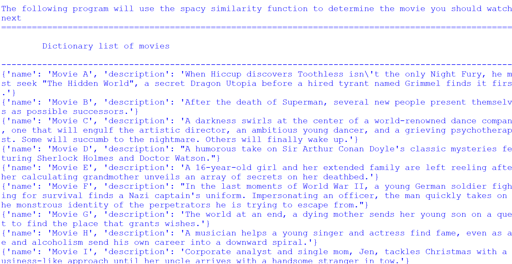
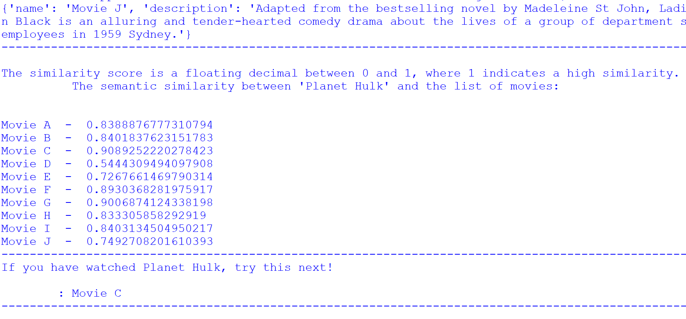

# Project name
Movie recommendation

# Project description
The project focuses on utilising spaCy for text similarity detection, primarily through the use of the 'similarity' keyword. It introduces the concept of vector representations of words and sentences. These vector representations enable quantitative measures of similarity between words or sentences.

*Importance of the project*

The project focuses on semantic similarity with spaCy, a valuable tool in natural language processing. It enables the comparison of words and phrases within a text through the use of word vector similarity, providing a robust foundation for various applications.

*What the project does*

In this particular project, the goal is to develop a system that suggests movies for users based on the similarity of movie descriptions. This innovation serves as a recommendation engine, helping users decide what to watch next. The method employed involves the use of for loops to systematically compare words. Specifically, each word (token1) is compared to all the other words (tokens) within the movie description. This process repeats for the next word (token2) in the description, creating a comprehensive analysis of semantic similarity.

To achieve this, the project involves reading in movie descriptions from an external file. Users are presented with the task of finding the next movie to watch, given a description. For example, if a user has watched "Planet Hulk" with a description detailing Hulk's journey from Earth to the planet Sakaar, where he becomes a gladiator, the system is designed to recommend the title of the most similar movie.

The significance of this project lies in its ability to enhance the user experience by offering tailored movie recommendations based on the content and themes of previously watched films. It showcases how natural language processing and semantic similarity can be applied to provide personalized and engaging content recommendations.

# Installation section
*Tell other users how to install your project locally*

1. Install Python: 
    1. Download Python IDLE 3.6.8 to run the program
    1. Visit the official Python website at https://www.python.org/downloads/windows/ in your web browser.
    1. Click on the "Download Python 3.6.8" button
    1. Under Files section, download the one that matches your system architecture (32-bit or 64-bit). Most modern systems are 64-bit.
    1. Click on the installer to download it.
    1. Locate the downloaded installer file and double-click on it to run the Python installer.
    1. Check the box that says "Add Python 3.6.8 to PATH." 
    1. Click the "Install Now" button to start the installation process.
     
1. Open the Command Prompt (cmd)
    1. Clone repository: `git clone <repository-url>`
    1. Navigate to the project directory: `cd "path\to\movie_recommendation"`

1. Create a Virtual Environment:
    1. Create a folder for new virtual env: `mkdir Virtual_env`
    1. Navigate to folder: `cd Virtual_env`
    1. Create a virtual environment: `virtualenv movie_recomvenv`

1. Activate the Virtual Environment:
    + In Windows Command Prompt (Admin):
    1. In your Virtual_env folder there will be a folder called Scripts. Copy its path.
    1. Change directory to Scripts `cd "path\to\scripts\in\virtual\environment"`
    1. Activate virtual environment: `activate.bat`
    1. You will see (bookshelfvenv) at the start of cmd line
    1. change directory to app root directory: `cd "path\to\app"`

1. Verify Python installation: `python --version`
1. Verify pip installation: `pip --version`
1. Install the dependencies: `pip install -r requirements.txt`    

# Usage section
*Instruct others on how to use your project after they’ve installed it*

*Outline the steps necessary to build and run your application with venv and Docker:*
+ Activate virtual environment [see above]

+ Install Docker desktop @ https://www.docker.com/products/docker-desktop
+ Open Docker Desktop
+ login to Docker Hub @ https://hub.docker.com/

## Use the Command Prompt
1. Check that Docker desktop was successfully installed: `docker run hello-world`
1. Build the docker image: `docker build -t movie_recom .` 
1. Run the docker image: `docker run movie_recom`
1. Deactivate the Virtual Environment: `deactivate`

## Use Docker Playground
1. Follow: https://labs.play-with-docker.com/
1. Start a new instance

In the terminal: 
1. Copy command from Docker Hub @ https://hub.docker.com/repository/docker/kcse1/semantic/tags?page=1&ordering=last_updated: `docker pull kcse1/semantic2:movie_recom`
1. Run the docker image: `docker run kcse1/semantic2:movie_recom`
1. Close session on Docker Playground

## Use Python IDLE
Run the program (F5) and select an option from the menu

1. Deactivate virtual environment in cmd when you are done working: `deactivate`

*Include screenshots of your project in action*

# Credits
*highlights and links to the authors of your project if the project has been created by more than one person*

@KC-software-en

# Add a URL to your GitHub repository

https://github.com/KC-software-en/semantic2

